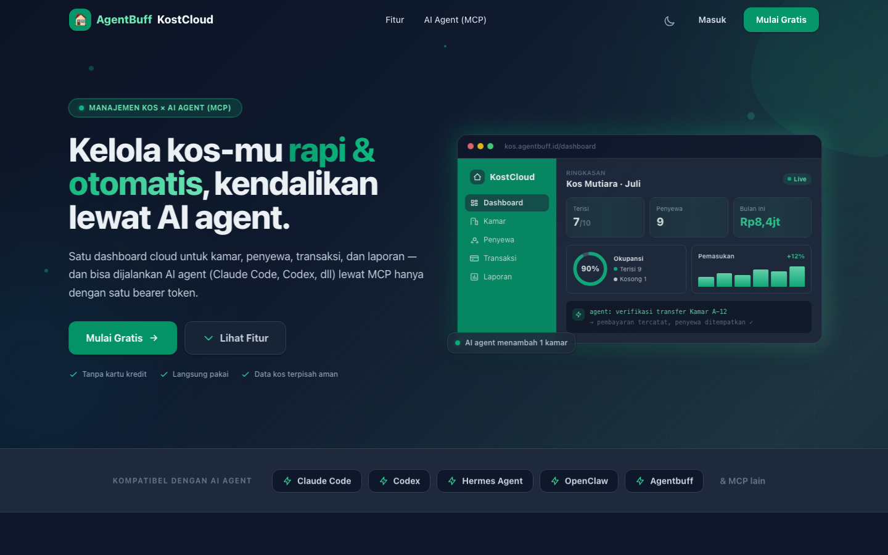
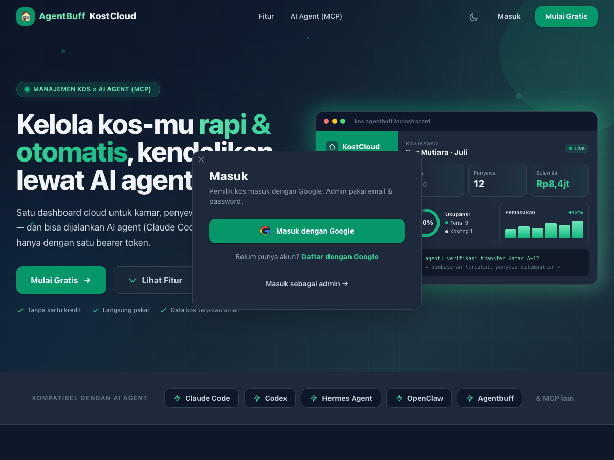
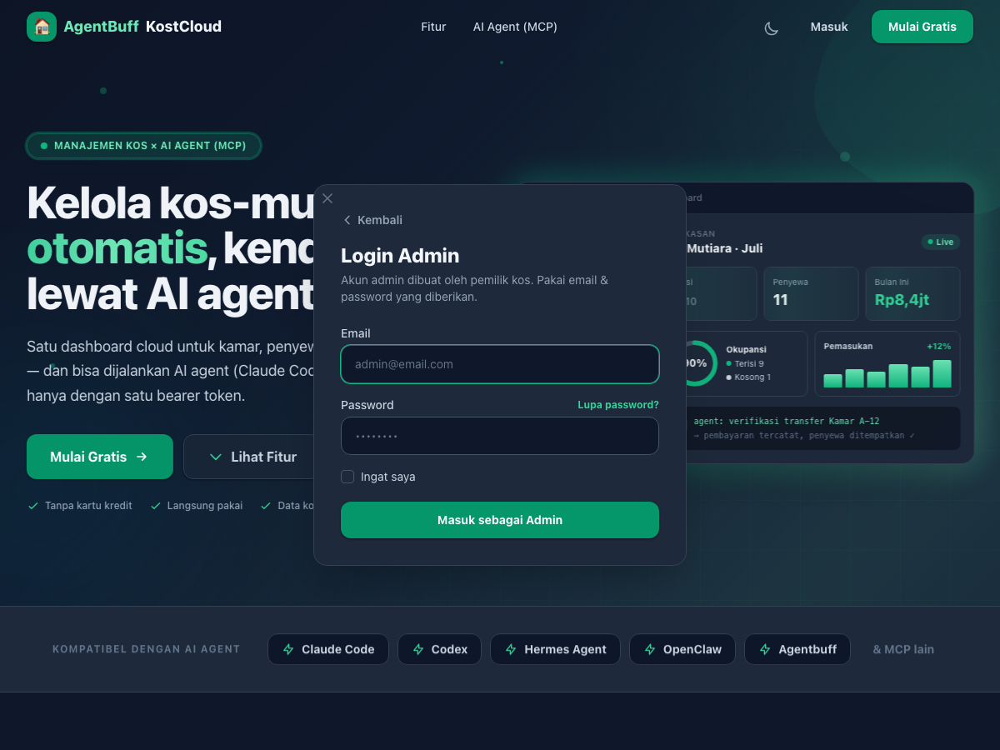

# AgentBuff KostCloud — Manajemen Kos Cloud + Kontrol AI Agent (MCP)

> **Portfolio showcase.** Ini etalase publik dari **AgentBuff KostCloud**, aplikasi manajemen kos internal berbasis subscription (SaaS multi-tenant) yang saya rancang & bangun *full-stack*. Source code lengkap berada di repositori privat — di sini saya tampilkan ringkasan produk, screenshot, arsitektur, dan beberapa potongan kode inti yang paling menarik.

KostCloud menggantikan spreadsheet & chat grup yang berantakan dengan **satu workspace cloud per pemilik kos**: kamar, penyewa, transaksi, laporan — tanpa reservasi publik. Dirancang **agentic-native**: hampir setiap kemampuan tersedia lewat UI web *dan* lewat **MCP server** (bearer token) sehingga bisa dijalankan agen AI (Claude Code, Codex, Hermes, OpenClaw, Agentbuff, dll.).

🟢 **Siap deploy** · 🏢 **Multi-tenant** · 🔐 **Google OAuth (owner)** · 🤖 **MCP / 14 tools** · 📱 **Responsif**

---

## ✨ Tampilan

### Landing page


### Masuk (Google untuk owner · email/password untuk admin)
<p align="center">
  
  
</p>

---

## 🎯 Masalah yang dipecahkan

Pemilik kos di Indonesia sering mengelola hunian lewat Excel, WhatsApp, dan catatan manual. Akibatnya: status kamar tidak akurat, pembayaran sulit dilacak, laporan cashflow lambat, dan admin operasional tidak punya akses terkontrol. KostCloud memberi **panel manajemen internal** (bukan marketplace) dengan isolasi data per pemilik, plus kontrol lewat AI agent bila diinginkan.

## 🧩 Fitur inti

| Modul | Ringkasan |
|---|---|
| **Workspace per owner** | Daftar/masuk owner via **Google**. Tiap kos punya `owner_id` di kamar, penyewa, transaksi, laporan — tanpa kebocoran antar tenant. |
| **Admin opsional** | Owner bisa membuat admin dengan email/password. Admin scoped ke kos yang sama; aksi teraudit. |
| **Kamar & tipe** | CRUD tipe (harga, kapasitas, fasilitas) + unit kamar per lantai; status available / occupied / maintenance. |
| **Penyewa sebagai data** | Bukan akun login publik. Biodata self-service lewat link token; checkout & hapus dengan alasan. |
| **Transaksi & bukti** | Catat pembayaran manual, verifikasi, bukti transfer privat, denda keterlambatan. |
| **Alokasi kamar terpusat** | Satu service: periode sewa *chaining* + penempatan pasca-bayar (kapasitas-aware, reaktivasi pivot). |
| **Laporan** | Generate laporan keuangan / status kamar / penyewa; ekspor PDF & Excel. |
| **Brand & dark mode** | Warna dasar custom per-owner + tema terang/gelap. |
| **Agentic (MCP)** | 14 tools (list/create/update/delete + laporan). Bearer Sanctum; otomatis di-scope; audit log + notifikasi owner/admin. |

## 🏗️ Arsitektur

```
┌──────────────────────────┐        ┌──────────────────────────┐
│  Browser (Blade + Alpine) │        │  Agen AI (klien MCP)      │
│  Tailwind · Vite · driver.js│      │  HTTP + Bearer Sanctum    │
└────────────┬─────────────┘        └────────────┬─────────────┘
             │  Session cookie                    │  /mcp
             └───────────────┬────────────────────┘
                             ▼
              ┌────────────────────────────────┐
              │  Laravel 12 (PHP 8.3)           │
              │  • ownerId() / InteractsWithOwner
              │  • RoomAllocationService (satu jalur)
              │  • AuditsMcpActions + LoggerService
              │  • DomPDF · PhpSpreadsheet       │
              └───────────────┬────────────────┘
                              ▼
                         MySQL 8
```

**Prinsip yang dipegang:**
1. **Isolasi tenant** — `owner_id` di data bisnis; query selalu di-scope.
2. **Parity UI ↔ MCP** — tool agent memakai service & aturan yang sama dengan panel.
3. **Occupancy mengikuti pembayaran** — penyewa baru tidak langsung ditempatkan tanpa transaksi terverifikasi.
4. **Admin tanpa nominal** — notifikasi operasional ke admin tidak membocorkan angka keuangan.
5. **Auth sesuai peran** — owner = Google; admin = email/password yang dibuat owner.

## 🛠️ Tech stack

**Backend:** Laravel 12 · PHP 8.3 · MySQL 8 · Laravel Breeze · Sanctum · Socialite (Google) · Laravel MCP  
**Frontend:** Blade · Tailwind CSS 3 · Alpine.js · Vite · driver.js (onboarding tour)  
**Export:** DomPDF · PhpSpreadsheet  
**Deploy:** Docker (PHP-FPM/cli + MySQL) · domain target `kos.agentbuff.id`

## 🔬 Sorotan kode

Beberapa potongan domain ada di [`code-highlights/domain/`](code-highlights/domain/):

- [`TenantScope.php`](code-highlights/domain/TenantScope.php) — resolusi `owner_id` untuk owner & admin.
- [`RoomAllocationService.php`](code-highlights/domain/RoomAllocationService.php) — chaining periode sewa + penempatan capacity-aware.
- [`InteractsWithOwner.php`](code-highlights/domain/InteractsWithOwner.php) — scope wajib di setiap tool MCP.
- [`AuditsMcpActions.php`](code-highlights/domain/AuditsMcpActions.php) — audit log + notifikasi (admin tanpa nominal).
- [`KostCloudServer.php`](code-highlights/domain/KostCloudServer.php) — katalog 14 MCP tools.

## 📐 Design system

Token warna, tipografi, radius, dan pola permukaan (landing / auth / panel / MCP) — lihat [`design-system.md`](design-system.md).

## 📦 Status

Aplikasi **full-stack yang bisa dijalankan**: owner masuk Google → onboarding → kelola tipe/kamar/penyewa/transaksi/laporan/admin → generate bearer MCP untuk agen AI. Transformasi dari single-tenant “Kos Mutiara 27” ke SaaS multi-tenant + MCP telah diselesaikan.

---

<sub>© 2026 — dibuat oleh <a href="https://github.com/adzkiyaqarina">@adzkiyaqarina</a>. Repositori ini adalah etalase portofolio; implementasi lengkap bersifat privat. Hak cipta dipertahankan.</sub>
